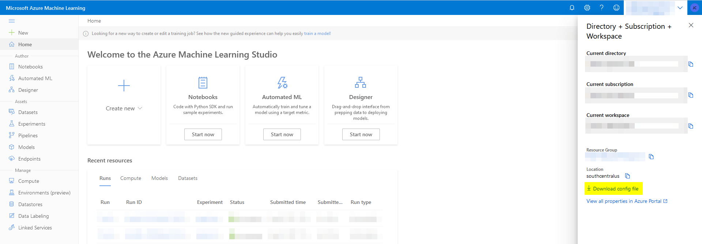

# automl-tutorial

In this tutorial, you will learn how to set up an AutoML training run with the Azure Machine Learning Python SDK. AutoML automatically picks an algorithm and hyperparameters for you and generates a model ready for deployment. 

# Prerequisites
- [Azure Machine Learning workspace](https://docs.microsoft.com/en-us/azure/machine-learning/how-to-manage-workspace?tabs=python).
- [Azure Machine Learning Python SDK](https://docs.microsoft.com/en-us/python/api/overview/azure/ml/install?view=azure-ml-py#default-install).

> **WARNING**: Python 3.8+ is not compatible with `automl`. Recommended for this tutorial: Python 3.7.9.

Required package installations:

```
pip install azureml-core==1.32.0
pip install azureml-train-automl==1.32.0
pip install azureml-automl-runtime==1.32.0
pip install onnxruntime==1.8.0
```

Alternatively, you can just run:

```
pip install requirements.txt
```

# Data source
This notebook uses the Auto MPG Dataset from [UCI Machine Learning Repository](https://archive.ics.uci.edu/ml/index.php) and builds a model to predict the fuel efficiency (MPG) of late-1970s and early-1980s automobiles.


# Get started
1. Complete prerequisites.
2. Download `config.json` file which can be downloaded from Azure Machine Learning studio website (Begins with https://ml.azure.com/). Place the downloaded `config.json` file in the notebooks directory. See below image. 
3. Go through the `automl.ipynb` notebook in the notebooks directory.



Running the `automl.ipynb` notebook in the notebooks directory creates the following output files in the data directory. 

Output files:
- `autompg.csv`: Cleaned dataset
- `autompg_train.csv`: Train dataset
- `autompg_test.csv`: Test dataset
- `best_model.onnx`: AutoML best model ONNX file
- `onnx_resource.json`: AutoML best run ONNX resource file

# Results
| Metric     | Value  |
| ---------- | ------ |
| MAE (Test) | 2.0110 |
| MSE (Test) | 7.3687 |

# References
- https://docs.microsoft.com/en-us/azure/machine-learning/how-to-configure-auto-train
- https://docs.microsoft.com/en-us/azure/machine-learning/tutorial-auto-train-models
- https://github.com/Azure/MachineLearningNotebooks/blob/master/how-to-use-azureml/automated-machine-learning/classification-bank-marketing-all-features/auto-ml-classification-bank-marketing-all-features.ipynb
